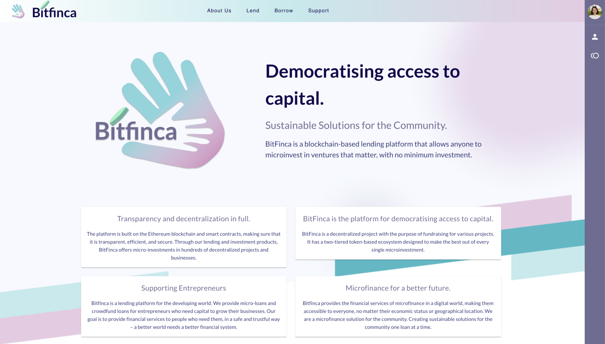

# Bitfinca: Democratising access to capital

1. **Deployment**
    - You will need to [create a MultiBaas deployment](https://www.curvegrid.com/docs/3-0-getting-started-creating-a-multibaas-deployment/) or have an existing deployment to use this sample.
2. **API Key**
    - You will also need to [provision an API key](https://www.curvegrid.com/docs/5-1-generate-api-keys/) with membership in the `DApp User` group.
3. **Mlti Token Contract**
    - In the `contracts` folder, copy the `.sample-curvenet-env` file to `.env` and fill in all of the blank values. Ensure that the private key has sufficient ETH to fund gas for contract deployments and setup. We are using the [truffle-multibaas-plugin](https://github.com/curvegrid/truffle-multibaas-plugin) to automate contract deployment to the blockchain, and setup within MultiBaas. For example, `truffle build` will compile the smart contracts, and `truffle migrate --reset` will compile the smart contracts (if required), redeploy them to the blockchain, and reconfigure MultiBaas.
4. **CORS Configuration**
    - Finally, you will need to update your CORS settings by going to `Admin` then `CORS Domains` and setting up the domain of the sample app. If you are running locally this will be `http://localhost:8080` by default.

After you have configured your deployment and smart contract, please fill out the required parameters below in `main.js`:

- `BASE_URL`
- `API_KEY`
